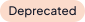

<!-- vale off -->

# Components

## Multi Object Selector

The Packs integration page and the Service Listings page use a component to display the various offerings. Packs
intergations use the `<Packs />` component, whereas the Service Tiers from App Mode use the `<AppTiers />` component.

To add a Pack to the list complete the following actions:

- Add a new markdown page for the Pack.
- In the frontmatter, set the type to the following value: `type: "integration"`.
- Populate the page with content.

To add a Service to the Service List complete the following actions:

- Add a new markdown page for the App Mode Service.
- In the frontmatter, set the type to the following value: `type: "appTier"`.
- Populate the page with content.

## Tabs component

To use the tabs component, you have to import it from the _shared_ folder.

After that, you can use it like this:

```js
<Tabs queryString="platform">
  <TabItem label="AWS" value="aws">
    # AWS cluster Lorem ipsum dolor sit amet, consectetur adipiscing elit.
  </TabItem>
  <TabItem label="VMware" value="vmware">
    # VMware cluster Lorem ipsum dolor sit amet, consectetur adipiscing elit.
  </TabItem>
</Tabs>
```

**Note**: If you want to create a link to a page with tabs, and link to a specific tab, you must do the following:

- Provide an identifier to the `Tabs` component `<Tabs queryString="clusterType">...</Tabs>`.
- When creating the link to this page, include (in the query) the identifier provided and the **value** you want (eg:
  `/clusters?clusterType=aws#section1`).
- The values can be one of the tab panel keys.
- Additionally, you may refer to different sections from the inner tab using the anchor points(using the #section-1).

## YouTube Video

To embed a YouTube video, use the YouTube component.

For example:

```js
<YouTube
  url="https://www.youtube.com/embed/wM3hcrHbAC0"
  title="Three Common Kubernetes Growing Pains  - and how to solve them"
/>
```

## Points of Interest

```js
<PointsOfInterest
  points={[
    {
      x: 20,
      y: 20,
      label: 1,
      description: "Lorem ipsum dolor sit amet, consectetur adipiscing elit.",
      tooltipPlacement: "rightTop",
    },
    {
      x: 80,
      y: 100,
      label: 2,
      description: "Lorem ipsum dolor sit amet, consectetur adipiscing elit.",
    },
    {
      x: 220,
      y: 230,
      description: "Lorem ipsum dolor sit amet, consectetur adipiscing elit.",
      tooltipPlacement: "rightTop",
    },
  ]}
>
  *Markdown content*
</PointsOfInterest>
```

**x** and **y** properties refer to the coordinates of the point starting from the **top-left corner** of the markdown
container.

> [!NOTE]
>
> The **_x_**, **_y_**, and **_description_** properties are **mandatory**. The **_label_** and **_tooltipPlacement_**
> properties are optional.

If no label is specified, the default one is "+".

Possible placements are: _topLeft_, _top_, _topRight_, _rightTop_, _right_ (default), _rightBottom_, _bottomRight_,
_bottom_, _bottomLeft_, _leftBottom_, _left_, _leftTop_.

## Tooltip

```js
<Tooltip>tooltip content</Tooltip>
```

**Notes**

- The tooltip icon can be customized by sending a [font awesome](https://fontawesome.com/icons?d=gallery) icon

## Video

To add a video, use the following syntax. Ensure you capitalize the letter "V":

```mdx
<Video src="/aws-full-profile.mp4"></Video>
```

```mdx
<Video title="vsphere-pcg-creation" src="/cluster-creation-videos/vmware.mp4"></Video>
```

## Badges

The following badges are available for use:

> [!NOTE]
>
> All badges are globally available. No need to import them.

- Technical Preview Badge 
  
- Deprecated Badge 
  

### Technical Preview Badge

The technical preview badge is used to indicate that a feature is in technical preview. The badge is intended for
release notes in the context of a list. The following is an example of how to use the technical preview badge. The
component will automatically display the badge in the correct color based on the light theme (dark/light).

```markdown
- <TpBadge /> Cluster Profile variables, a new feature that allows you to define variables in a cluster profile. This
  feature is in Tech Preview and is available only for Edge clusters. Profile variables allow you to define variable
  types, apply validation, and more. Refer to the Cluster Profile Variables documentation to learn more about profile
  variables.
```

### Deprecated Badge

Use the deprecated badge to indicate that a feature is deprecated. The badge is intended for list or table content. The
component automatically displays the correct badge color for the active light or dark theme.

```markdown
- <DeprecatedBadge /> Edge site deployment via MAAS is deprecated and no longer receives updates. Refer to the
  Announcements page for additional information and alternatives.
```

## Simple Card Grid

This is a custom component that creates a grid of simple text cards with two columns, styled according to our color
scheme. The rows of cards are dynamically created according to the list of specified cards. This component uses the
`VersionedLink` under the covers.

```js
<SimpleCardGrid
  cards={[
    {
      title: "Lorem Ipsum",
      description: "Lorem ipsum dolor sit amet, consectetur adipiscing elit.",
      buttonText: "Learn more",
      url: "/path/to/link",
    },
    {
      title: "Lorem Ipsum",
      description: "Lorem ipsum dolor sit amet, consectetur adipiscing elit.",
      buttonText: "Learn more",
      url: "/path/to/link",
    },
    {
      title: "Lorem Ipsum",
      description: "Lorem ipsum dolor sit amet, consectetur adipiscing elit.",
      buttonText: "Learn more",
      url: "/path/to/link",
    },
  ]}
/>
```

## Partials Component

This is a custom component that allows you to create and use Docusaurus'
[Import Markdown](https://docusaurus.io/docs/markdown-features/react#importing-markdown) functionality.

> [!IMPORTANT]
>
> Docusaurus does not provide the ability to dynamically configure table of contents. See
> [this issue](https://github.com/facebook/docusaurus/issues/6201) for more information. This means that you should
> avoid adding headings to partials that you intend to use with the Partials Component.
>
> If you require headings, then you should import your partials using the guidance on the Docusaurus
> [Import Markdown](https://docusaurus.io/docs/markdown-features/react#importing-markdown) page.

Partials must be created under the `_partials` folder. They must be named using an `_` prefix and the `*.mdx` filetype.
Partials may be organised in any further subfolders as required. For example, you could create
`_partials/public-cloud/_palette_setup.mdx`.

In order to aid with organisation and categorization, partials must have a `partial_category` and `partial_name` defined
in their frontmatter:

```mdx
---
partial_category: public-cloud
partial_name: palette-setup
---

This is how you set up Palette in {props.cloud}.
```

Partials are customized using properties which can be read using the `{props.field}` syntax.

Once your partial has been created, run the `make generate-partials` command to make your partial available for use.
This command will also be invoked during the `make start` and `make build` commands.

Finally, you can reference your partial in any `*.md` file by using the `PartialsComponent`, together with the specified
category and name of the partial:

```md
<PartialsComponent
  category="example-cat"
  name="example-name"
  message="Hello!"
/>
```

The snippet above will work with the example partial we have in our repository, so you can use it for testing.

Note that the `message` field corresponds to the `{props.message}` reference in the `_partials/_partial_example.mdx`
file.

### Numbered Lists

Multi-step partials that do not begin a new procedure (start with 1) cannot be reused if the partial is written in
typical MDX syntax. The example below shows a small snippet of a procedure.

```mdx
---
partial_category: clusters-aws-account-setup
partial_name: example
---

1. **Validate** your AWS credentials. A green check mark indicates valid credentials.

2. Toggle **Add IAM Policies** on and use the **Policies** drop-down menu to select any desired IAM policies.

3. Select **Confirm** to add your AWS account to Palette.
```

This partial could be reused in several places, as there are several types of AWS accounts and authentication methods.
However, the steps prior to this partial vary based on the procedure. For example, the partial may need to start at step
6 for AWS Commercial cloud but step 10 for AWS Secret cloud, which makes reuse tricky. Since MDX files are generated at
runtime instead of buildtime, implementing it in either of the following ways will _not_ work.

<!-- prettier-ignore-start -->

```md
6. In Palette, paste the role ARN into the **ARN** field.

7. <PartialComponent category="clusters-aws-account-setup" name="example" />
   <!-- creates a nested list on step 7 that begins with step 1 -->

<PartialComponent category="clusters-aws-account-setup" name="example" /> <!-- creates a new list starting at 1 -->
```

<!-- prettier-ignore-end -->

There are several other ways you can manipulate the partial in an attempt to fix this issue, but only _one_ works. To
reuse a mid-procedure partial that contains a numbered list, create each step item _except the first step_ as an HTML
list item (`<li>`).

```mdx
---
partial_category: clusters-aws-account-setup
partial_name: example
---

**Validate** your AWS credentials. A green check mark indicates valid credentials.

<li> Toggle **Add IAM Policies** on and use the **Policies** drop-down menu to select any desired IAM policies.</li>

<li>Select **Confirm** to add your AWS account to Palette.</li>
```

When you reference the partial in a markdown file, put the partial _after_ the numbered step. Doing so establishes the
step number for the first item, and the steps indicated with `<li>` are rendered with the correct subsequent numbers.

<!-- prettier-ignore-start -->

```md
6. In Palette, paste the role ARN into the **ARN** field.

7. <PartialComponent category="clusters-aws-account-setup" name="example" />

8. Additional step.
```

<!-- prettier-ignore-end -->

Any steps that come _after_ partial are updated with the correct values during runtime. For example, the above partial
would be rended as follows.

<!-- prettier-ignore-start -->

```md
6. In Palette, paste the role ARN into the **ARN** field.

7. **Validate** your AWS credentials. A green check mark indicates valid credentials.

8. Toggle **Add IAM Policies** on and use the **Policies** drop-down menu to select any desired IAM policies.

9. Select **Confirm** to add your AWS account to Palette.

10.  Additional step.
```
<!-- prettier-ignore-end -->

## Palette/VerteX URLs

A special component has been created to handle the generation of URLs for Palette and VerteX. The component is called
[PaletteVertexUrlMapper](../../src/components/PaletteVertexUrlMapper/PaletteVertexUrlMapper.tsx). This component is
intended for usage withing partials. You can use the component to change the base path of the URL to either Palette or
VerteX. The component will automatically prefix the path to the URL. The component has the following props:

- `edition` - The edition of the URL. This can be either `Palette` or `Vertex`. Internally, the component will use this
  value to determine the base URL.
- `text` - The text to display for the link. To include a property value, wrap the text in `{``}` and insert the
  property using `${props.field}`.
- `url` - The path to append to the base URL.

Below is an example of how to use the component:

```mdx
- System administrator permissions, either a Root Administrator or Operations Administrator. Refer to the
  <PaletteVertexUrlMapper
    edition={props.edition}
    text="System Administrators"
    url="/system-management/account-management"
  />
  page to learn more about system administrator roles.
```

Below is an example of how to use the component when you want the link text to include a property value:

```mdx
<PaletteVertexUrlMapper
  edition={props.edition}
  text={`Install Airgap ${props.version}`}
  url="/supported-environments/vmware/install/airgap"
/>
```

In cases where Palette and Vertex pages have different URLs beyond the base path, the component will accept the
following props:

- `edition` - The edition of the URL. This can be either `Palette` or `Vertex`. Internally, the component will use this
  value to determine the base URL.
- `text` - The text to display for the link.
- `palettePath` - The Palette path to append to the base URL.
- `vertexPath` - The VerteX path to append to the base URL.

Below is an example of how to use the component when the URLs are different:

```mdx
- System administrator permissions, either a Root Administrator or Operations Administrator. Refer to the
  <PaletteVertexUrlMapper
    edition={props.edition}
    text="System Administrators"
    palettePath="/system-management/account-management"
    vertexPath="/system-management-vertex/account-management"
  />
  page to learn more about system administrator roles.
```
