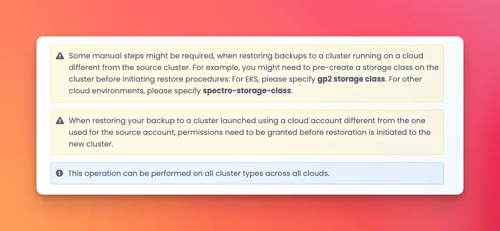
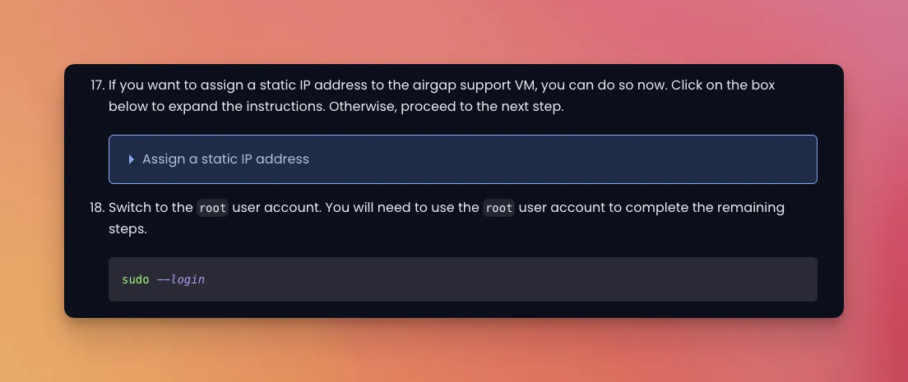
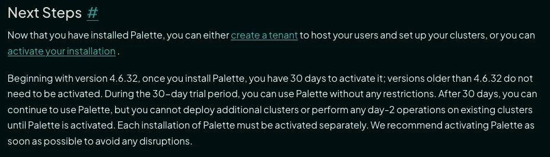

<!-- vale off -->

# Spectro Cloud Internal Style Guide

This document is maintained by the Spectro Cloud Documentation Team of writers chartered to set and maintain
readability, usage, correctness, and consistency for Spectro Cloud’s documentation content.

For reference materials not covered in this guide, defer to the
[Google Developer Documentation Style Guide](https://developers.google.com/style).

- [Inclusive English for a Global Audience](#inclusive-english-for-a-global-audience)
  - [Simplified English](#simplified-english)
  - [Voice](#voice)
    - [Active Voice](#active-voice)
    - [Passive Voice](#passive-voice)
  - [Present Tense](#present-tense)
  - [Simplicity Assumption](#simplicity-assumption)
  - [Ableist Language](#ableist-language)
  - [Inclusive Software Interactions](#inclusive-software-interactions)
  - [Real-World Names and Locations](#real-world-names-and-locations)
  - [Gender](#gender)
  - [Contractions](#contractions)
  - [Wordiness](#wordiness)
    - [Angle Brackets (>)](#angle-brackets-)
    - [UI Elements as Verbs](#ui-elements-as-verbs)
  - [Latin Phrases](#latin-phrases)
- [Grammar Guidance](#grammar-guidance)
  - [American Spelling](#american-spelling)
  - [Capitalization](#capitalization)
    - [Headings](#headings)
    - [Headline Style](#headline-style)
    - [Acronyms and Initialisms](#acronyms-and-initialisms)
  - [Parentheses](#parentheses)
    - [Clarifying Values or Examples](#clarifying-values-or-examples)
    - [List Items](#list-items)
    - [Optional Steps](#optional-steps)
    - [Parenthetical Expressions and Jargon](#parenthetical-expressions-and-jargon)
    - [Single and Plural Subjects](#single-and-plural-subjects)
  - [Commas](#commas)
  - [Prepositions](#prepositions)
  - [Dialogue](#dialogue)
  - [Numbers](#numbers)
  - [Lists](#lists)
  - [Colons](#colons)
  - [Computer Resources (Units of Measurement)](#computer-resources-units-of-measurement)
- [Other Style Choices](#other-style-choices)
  - [Future Features](#future-features)
  - [Directionals](#directionals)
  - [Emoticons](#emoticons)
  - [Text Formatting](#text-formatting)
    - [Commands & Parameters](#commands--parameters)
      - [Command Output](#command-output)
        - [Lengthy Output](#lengthy-output)
    - [Product UI Naming](#product-ui-naming)
- [Documentation UI Components](#documentation-ui-components)
  - [Markdown Tables](#markdown-tables)
  - [Admonitions](#admonitions)
  - [Supplemental Information](#supplemental-information)
  - [Next Steps](#supplemental-information)
  - [Resources List](#resources-list)
- [Image File Naming Standard](#image-file-naming-standard)

# Inclusive English for a Global Audience

At Spectro Cloud, we want to write with inclusivity in mind. Our products are not only complex but our users come from a
wide range of diverse backgrounds. This includes their technology skills, the languages they speak, the cultures they
are a part of, and any disabilities they may have. As a result, we want to make our content clear, relatable, and avoid
the assumption that all users interact with our software in the same way (such as in the case of disabilities).

The following sections explain many of the tactics we use to achieve our goal of inclusive documentation.

## Simplified English

Use simple English unless explicitly stated otherwise in this guide. Simple language helps the reader retain information
and more readily understand concepts while also making our material more accessible to those for whom English is not a
first language.

| Good ✅                                                                                                                                          | Bad ❌                                                        |
| ------------------------------------------------------------------------------------------------------------------------------------------------ | ------------------------------------------------------------- |
| The core Kubernetes API is flexible and can also be extended to support custom resources.                                                        |
| The interior Kubernetes API is malleable and provides the capability for consumers to extended custom logic and inject custom logical resources. |
| Choose a node to be the cluster master node.                                                                                                     | Designate a node to be the cluster master node.               |
| Drain the node before a version upgrade.                                                                                                         | It is essential to drain the node prior to a version upgrade. |

## Voice

Write in a simple voice. We explain our processes and actions with simple messages and to the point.

As a general rule, use active voice by default. Use passive only when the actor is unknown, irrelevant, or when
emphasizing the result.

### Active Voice

Use the active voice whenever possible. It’s more direct, clear, and concise.

When documenting a procedure or instructing the user to do something, especially in a numbered list, we should always
use the active voice.

Use “you” to address the user directly. Use “we” when providing recommendations.

| Active Voice ✅                                                                                 | Passive Voice ❌                                                                                   |
| ----------------------------------------------------------------------------------------------- | -------------------------------------------------------------------------------------------------- |
| _Use_ the `kubectl` CLI to create a namespace titled `mgmt`.                                    | The `kubectl` CLI _can be used_ to create namespaces titled `mgmt`.                                |
| Before upgrading, _review_ the release notes for breaking changes.                              | Release notes _should be_ carefully _reviewed_ for breaking changes before an upgrade.             |
| We _recommended_ deploying Palette in a highly-available configuration of at least three nodes. | It _is recommended_ to deploy Palette in a highly-available configuration of at least three nodes. |

### Passive Voice

Use the passive voice when:

- The actor is unknown, irrelevant, or implied.

- You want to emphasize the result over the person or system doing the action.

- You are listing known limitations or system constraints.

- You are following a neutral, objective, or formal tone.

| Acceptable ✅                                            | Why?                                                                              |
| -------------------------------------------------------- | --------------------------------------------------------------------------------- |
| Autoscaling is not supported for GKE clusters.           | Limitation (actor is assumed or not important; focus is on what is not supported) |
| The node must be drained before the upgrade can proceed. | Emphasis on receiver of actor (what needs to be done, not who does it)            |
| A new token is generated automatically.                  | Focus is on outcome, not actor                                                    |

> [!TIP]
>
> Below are some great resources to help you differentiate between active and passive voice:
>
> - [Active and Passive Voice Rules - Josh Jagran](https://www.jagranjosh.com/articles/active-and-passive-voice-rules-with-examples-1748263067-1)
> - [How to Move from Passive to Active Voice in Your Business Writing - For Dummies](https://www.dummies.com/article/business-careers-money/careers/general-careers/move-passive-active-voice-business-writing-242741/)

## Present Tense

Users read documentation to perform tasks or gather information. For users, these activities occur in the present, so
the present tense is proper in most cases. The present tense is also easier to read than the past or future tense.

Use future tense only when you emphasize that something will occur later (from the users' perspective). To quickly find
and remove instances of future tense, search for will.

## Simplicity Assumption

Our products improve the Kubernetes experience and greatly reduce the challenges encountered with Kubernetes, but at the
end of the day, our workflows are still complicated. Avoid injecting assumptions into the text. Readers find it
frustrating to read documentation that states an action or set of actions is easy. Show compassion to the reader and
make it “easy” by providing clear and concise guidance. Omit the subjective terms.

| Good ✅                                                                               | Bad ❌                                        |
| ------------------------------------------------------------------------------------- | --------------------------------------------- |
| Deploy the container in a few steps.                                                  | Deploy the container in a few _simple_ steps. |
| Palette reduces the overhead and common challenges encountered when using Kubernetes. | Palette makes Kubernetes _easy to use_.       |

## Ableist Language

Do not use ableist language. Ableist language takes words that have historically, or are currently, used to describe
people with disabilities, and uses them in a discriminatory or dismissive manner. Ableist language includes words or
phrases such as _crazy_, _insane_, _blind to_ or _blind eye to_, _cripple_, _dumb_, _master_, _slave_, and _others_.

Identify hierarchical structures using the terms _control plane_, _worker_, _primary_, and _secondary_.

| Good ✅                                                                                             | Bad ❌                                                                                       |
| --------------------------------------------------------------------------------------------------- | -------------------------------------------------------------------------------------------- |
| Before launch, give everything a _final check for completeness and clarity_.                        | Before launch, give everything a final _sanity-check_.                                       |
| It _slows down_ the service, causing a poor user experience until the queue clears.                 | It _cripples_ the service, causing a poor user experience until the queue clears.            |
| Replace the _placeholder_ in this example with the appropriate value.                               | Replace the dummy variable in this example with the appropriate value.                       |
| You can customize the repave time interval for all node pools except the _control plane_ node pool. | You can customize the repave time interval for all node pools except the _master_ node pool. |

## Inclusive Software Interactions

Phones, tablets, screen readers, and other tools have changed the way users interact with technology. While we do not
forbid using verbs such as “click,” it is important to understand the accessibility and media implications of certain
verbs and use alternatives when possible.

Our top priority is clarity. If rephrasing a sentence to be inclusive results in a lengthy, convoluted, or awkward
sentence, use the verb that makes the content the most clear.

| Inclusive ✅                                                | Non-Inclusive ❌                  |
| ----------------------------------------------------------- | --------------------------------- |
| "The text _appears_" or "The text _is displayed_.”          | “You will _see_ the text appear.” |
| "_Go_ to section 5" or "_Navigate_ to section 5."           | "_Jump_ to section 5."            |
| "_Select_ the green button" or "_Choose_ the green button." | "_Click_ the green button."       |

> [!NOTE]
>
> “Run” in the context of “run a program” or “run a command” is widely understood and is generally considered inclusive.

## Real-World Names and Locations

Try to use diverse names, ages, and locations in examples. As a U.S.-based company, avoid only using Western locations
and names. The Google Style Guide has a great list of
[common international names](https://developers.google.com/style/examples#names).

| Good ✅                                                                                                                                                            | Bad ❌                                                                                                                                       |
| ------------------------------------------------------------------------------------------------------------------------------------------------------------------ | -------------------------------------------------------------------------------------------------------------------------------------------- |
| The NOC-UI displays three active clusters. The following example displays two active clusters available in _eastern Asia_ and another cluster in _central Europe_. | The NOC-UI displays three active clusters. The following image displays three active clusters in _North America’s west and eastern regions_. |
| Lee and Raha are both experienced engineers that fit the decision maker persona.                                                                                   | John and Dave are both experienced engineers that fit the decision maker persona.                                                            |

## Gender

Use gender-neutral pronouns. Avoid the pronouns _he_, _him_, _his_, _she_, or _her_. The same applies to _he/she_ or
_(s)he_ or other such punctuational approaches. Use the singular _they_. Better yet, engage the reader using _you_ or
_your_, as shown in the second example below.

| Good ✅                                                                                                                       | Bad ❌                                                                                                                      |
| ----------------------------------------------------------------------------------------------------------------------------- | --------------------------------------------------------------------------------------------------------------------------- |
| In previous outages, one of the operators did not follow best practices. They merged source code directly to the main branch. | In previous outages, one of the operators did not follow best practices. He merged source code directly to the main branch. |
| You can create and deploy custom images to most infrastructure providers using various tools.                                 | The user can create and deploy custom images to most infrastructure providers using various tools.                          |

## Contractions

Avoid contractions (using an apostrophe is used to combine two words into one). For example, words such as _they’ve_ and
_can't_ may be difficult for non-native English speakers to comprehend. Therefore, it is recommended to not use them.

| Good ✅                                                                                                         | Bad ❌                                                                                                        |
| --------------------------------------------------------------------------------------------------------------- | ------------------------------------------------------------------------------------------------------------- |
| You cannot scale down the number of nodes in a PCG.                                                             | You can’t scale down the number of nodes in a PCG.                                                            |
| If you are using a built-in search feature, ensure it is case-insensitive.                                      | If you're using a built-in search feature, ensure it's case-insensitive.                                      |
| Now that you have deployed a MAAS cluster, you can start developing and deploying applications to your cluster. | Now that you’ve deployed a MAAS cluster, you can start developing and deploying applications to your cluster. |

## Wordiness

To reduce the length of sentences and make documentation more concise, use the following tactics when possible.

### Angle Brackets (`>`)

Angle brackets are a common documentation strategy for combining several small, related steps when there is little room
for misinterpretation or confusion, allowing the reader to focus on what they need to do rather than get bogged down by
transitional words (e.g. _then_, _next_). Use only if the elements are on the same screen or are within close proximity
of one another.

If the UI element does not have any text associated with it (e.g. _main menu_, _drop-down menu_) do not use angle
brackets.

| Good ✅                                                                      | Bad ❌                                                                           |
| ---------------------------------------------------------------------------- | -------------------------------------------------------------------------------- |
| On the cluster **Overview** tab, select **Settings** > **Cluster Settings**. | On the cluster **Overview** tab, select **Settings**, then **Cluster Settings**. |
| From the left main menu, select **Cluster Profiles**.                        | Navigate to left main menu **> Cluster Profiles**.                               |

### UI Elements as Verbs

Allow UI elements to be incorporated as verbs where appropriate. Do not substitute a UI element if it results in a
grammatically incorrect sentence or causes you to change the text of the UI element.

| Good ✅                                                                       | Bad ❌                                                                                                                                            |
| ----------------------------------------------------------------------------- | ------------------------------------------------------------------------------------------------------------------------------------------------- |
| **Save** your changes.                                                        | Click **Save** to save your changes.                                                                                                              |
| After you are finished modifying a profile layer, select **Confirm Updates**. | • After you are finished modifying a profile layer, Confirm Updates.<br>• After you are finished modifying a profile layer, Confirm your Updates. |

## Latin Phrases

Avoid using the following Latin phrases, as their meaning is not understood by all.

- _e.g_ (exempli gratia) - “For example”

- _i.e._ (id est) - “In other words”

| Good ✅                                                                                                                                 | Bad ❌                                                                                                                                                           |
| --------------------------------------------------------------------------------------------------------------------------------------- | ---------------------------------------------------------------------------------------------------------------------------------------------------------------- |
| • Modification of kernel parameters (_for example_, `core_pattern`)                                                                     | • Modification of kernel parameters (_e.g._, core_pattern)                                                                                                       |
| These images install an immutable OS and software dependencies compatible with a specific Kubernetes version during cluster deployment. | These images install an immutable OS and software dependencies compatible with a specific Kubernetes version at runtime (_i.e._, during the cluster deployment). |

# Grammar Guidance

Like our users, Spectro Cloud is made up of individuals from a wide range of backgrounds. As a U.S.-based company, we
use American English for our documentation, which has its own spelling and punctuation variations; however, there are
certain exceptions, such as the Oxford comma. The following sections serve as a quick reference for certain grammar
rules.

## American Spelling

Always use American Spelling. While certain spelling variations are well known (e.g. _grey_ vs. _gray_), others are
often overlooked. Some common offenders are listed below.

- _Afterward_ (not _afterwards_)

- _Forward_ and _backward_ (not _forwards_ and _backwards_)

- _Toward_ (not _towards_)

## Capitalization

Capitalize the first word of a sentence and all proper nouns, such as product names.

| Good ✅                                                                         | Bad ❌                                                                          |
| ------------------------------------------------------------------------------- | ------------------------------------------------------------------------------- |
| A common container orchestration platform used in the industry is _Kubernetes_. | a common container orchestration platform used in the industry is _kubernetes_. |
| Navigate to the _Palette_ console.                                              | Navigate to the _palette_ console.                                              |

### Headings

Avoid using an acronym for the first time in a title or heading unless it is a keyword you need to place in the title or
heading for Search Engine Optimization (SEO). If the first use of the acronym is in a title or heading, introduce the
acronym (in parentheses, following the spelled-out term) in the following body text. Aim for descriptive headings and
titles to help users navigate the page. From a user perspective, it's easier to navigate between pages and sections of a
page if the headings and titles are unique.

- If the heading is more in line with a task, such as our how-to docs and tutorials, start with the plain form of the
  task’s base form: _**Migrate** to Palette_.

- If the heading is conceptual or non-task-based, then start with a noun: _**Migration** to Palette_.

- Do not use verbs ending with _-ing_ (gerund).

### Headline Style

Use title case for headings. Below are some helpful tips.

- Capitalize the first and last words, nouns, pronouns, verbs, adjectives, adverbs, and subordinating conjunctions
  (_if_, _because_, _as_, _that_, and so on).

- Don't capitalize articles (_a_, _an_, _the_), coordinating conjunctions (_and_, _but_, _or_, _nor_), the _to_ in an
  infinitive, and prepositions (_with_, _to_, _for_, _in_, _from_).

- For hyphenated words, capitalize the first and subsequent elements unless they are articles, prepositions, and
  coordinating conjunctions.

| Good ✅                           | Bad ❌                            |
| --------------------------------- | --------------------------------- |
| Deploy a Pack Registry Server     | Deploying A Pack Registry Server  |
| Access Audit Logs                 | Accessing audit logs              |
| Quick Start with Palette App Mode | Quick start with Palette app mode |
| The Command-Line Interface        | The command-line interface        |

### Acronyms and Initialisms

Use title case when defining an acronym (an abbreviation pronounced as its own word) or initialism (an abbreviation
pronounced as individual letters) that is a **proper noun**. If it is a common noun, use sentence case. Use the
abbreviation on all subsequent uses.

Use the same rules that apply to headline styles. Some acronyms are, by nature, written using camel case, such as,
_IaaS_, _kCh_, and _SaaS_.

> [!IMPORTANT]
>
> Certain acronyms and initialisms (such as _OS_, _CPU_, _IP_, and more) are considered industry standard and do not
> need to be spelled out. Refer to the Vale file
> [acronym-no-expand.yml](https://github.com/spectrocloud/spectro-vale-pkg/blob/main/packages/spectrocloud-docs-internal/styles/spectrocloud-docs-internal/acronym-no-expand.yml)
> for a list of exceptions.

## Parentheses

Parentheses are often considered distracting or confusing. Only use them in certain situations.

| Use Case                                                                                          | Allowed      |
| ------------------------------------------------------------------------------------------------- | ------------ |
| [Acronyms and initialisms](#acronyms-and-initialisms)                                             | ✅           |
| [Clarifying values or examples](#clarifying-values-or-examples) (parameters, values, files, etc.) | ✅           |
| [List items](#list-items)                                                                         | ❌           |
| [Optional steps](#optional-steps)                                                                 | ✅           |
| [Parenthetical expressions and jargon](#parenthetical-expressions-and-jargon)                     | ⚠️ (depends) |
| [Single and plural subjects](#single-and-plural-subjects)                                         | ❌           |

### Clarifying Values or Examples

Specify parameters, values, files, and similar data to clarify the actions a customer needs to take. Parentheses are not
required if the context or next actions are clear.

| Good ✅                                                                                                                                                                                            | Also Acceptable 👍                                                                                                                                                                                       |
| -------------------------------------------------------------------------------------------------------------------------------------------------------------------------------------------------- | -------------------------------------------------------------------------------------------------------------------------------------------------------------------------------------------------------- |
| Configure the RHEL OS (`OS_DISTRIBUTION=rhel`) and the AMD64 architecture (`ARCH=amd64`).                                                                                                          | Configure the RHEL OS and the AMD64 architecture.<br><br><code>export OS_DISTRIBUTION=rhel</code><br><code>export ARCH=amd64</code>                                                                      |
| Specify a remote repository using the standard address format (for example, `example.com/bundle/example-bundle.tar.zst`), or use the URI format (`file:///path/to/bundle`) for local repositories. | Specify a remote repository using the standard address format, such as `example.com/bundle/example-bundle.tar.zst`, or use the URI format for local repositories. For example, `file:///path/to/bundle`. |
| This procedure requires a physical or virtual Linux machine with an AMD64 (x86_64) processor architecture.                                                                                         | This procedure requires a physical or virtual Linux machine with an AMD64 or x86_64 processor architecture.                                                                                              |

### List Items

This procedure requires a physical or virtual Linux machine with an AMD64 or x86_64 processor architecture.

| Good ✅                                                                                                                     | Bad ❌                                                                                                                     |
| --------------------------------------------------------------------------------------------------------------------------- | -------------------------------------------------------------------------------------------------------------------------- |
| • PXK-E - The `K8S_DISTRIBUTION=kubeadm` value in the `.arg` file for non-FIPS or `K8S_DISTRIBUTION=kubeadm-fips` for FIPS. | • PXK-E (the `K8S_DISTRIBUTION=kubeadm value` in the `.arg` file for non-FIPS or `K8S_DISTRIBUTION=kubeadm-fips` for FIPS) |

### Optional Steps

Preface optional steps with the text _(Optional)_. This allows customers to identify optional steps at a glance,
preventing them from reading through or performing actions that may not be applicable to their situation (or worse,
performing an action only to later realize they are not the intended audience, thus disrupting or compromising their
workflow).

If applicable, place the circumstance that makes the step optional **immediately** after _(Optional)_ so that customers
can quickly decide to proceed with or skip the step.

| Good ✅                                                                                                                                                                                                                                                                                              | Bad ❌                                                                                                                                                                                                                                                |
| ---------------------------------------------------------------------------------------------------------------------------------------------------------------------------------------------------------------------------------------------------------------------------------------------------- | ----------------------------------------------------------------------------------------------------------------------------------------------------------------------------------------------------------------------------------------------------- | ----------------------------------------------------- | ---------------------------------------------------------------------------------------------------------------------------------------------------------------------------------------------------------------------------------------------- | -------------------------------------------- | ------------------------------------------------------------------------------------------------------------------------------------------ |
| 3. (Optional) To ensure reproducible builds and consistent compliance behavior, you can pin a specific STIG content version before building the base RHEL 9 STIG image <br><br><code>bash rhel-stig/scripts/update-stig-content.sh <stig-content-version></code>                                     | 3. To ensure reproducible builds and consistent compliance behavior, you can pin a specific STIG content version before building the base RHEL 9 STIG image <br><br><code>bash rhel-stig/scripts/update-stig-content.sh <stig-content-version></code> |
| 5. (Optional) _If you are using a self-hosted instance of Palette_, build the ISO using the corresponding CanvOS version. <br><br><code>curl --location --request GET 'https://<palette-endpoint>/v1/services/stylus/version' --header 'Content-Type: application/json' --header 'Apikey: <api-key>' | jq --raw-output '.spec.latestVersion.content                                                                                                                                                                                                          | match("version: ([^\n]+)").captures[0].string'</code> | 5. (Optional) Build the ISO using the corresponding CanvOS version. <br><br><code>curl --location --request GET 'https://<palette-endpoint>/v1/services/stylus/version' --header 'Content-Type: application/json' --header 'Apikey: <api-key>' | jq --raw-output '.spec.latestVersion.content | match("version: ([^\n]+)").captures[0].string'</code><br><br>:::warning<br><br>This step only applies to self-hosted instances.<br><br>::: |

### Parenthetical Expressions and Jargon

Avoid using parentheses, including the Latin phrase _i.e._ (id est), to include additional information or present
information in an alternate manner.

> [!TIP]
>
> If you are tempted to use parentheses as an alternate way to explain a concept, it is likely an indicator that you can
> use the “simplified” version instead. Doing so makes the documentation more accessible to less-experienced users and
> helps limit jargon.

If introducing a lesser-known phrase that will be used throughout the page, you can use a similar approach to acronyms
and initialisms, where you explain the term first and later reference it in parentheses.

| Good ✅                                                                                                                                          | Bad ❌                                                                                                                                                         |
| ------------------------------------------------------------------------------------------------------------------------------------------------ | -------------------------------------------------------------------------------------------------------------------------------------------------------------- |
| These images install an immutable OS and software dependencies compatible with a specific Kubernetes version during cluster deployment.          | These images install an immutable OS and software dependencies compatible with a specific Kubernetes version at runtime (i.e., during the cluster deployment). |
| Palette replaces unhealthy nodes automatically to maintain the desired cluster state.                                                            | Palette repaves unhealthy nodes (replaces them with new ones that match the original configuration) automatically to maintain the desired cluster state.       |
| Maintenance Mode - Turn off scheduling (cordon) and migrate (drain) workloads to other healthy nodes in the cluster without service disruptions. | Maintenance Mode - Cordon and drain nodes, migrating workloads to other healthy nodes in the cluster without service disruptions.                              |

### Single and Plural Subjects

In situations where an action or situation may affect one or more subjects, default to the plural form of the subject.

| Good ✅                                                 | Bad ❌                                                    |
| ------------------------------------------------------- | --------------------------------------------------------- |
| The cluster _nodes_ will automatically scale down.      | The cluster _node(s)_ will automatically scale down.      |
| _Users_ may want to disable health checks if necessary. | _User(s)_ may want to disable health checks if necessary. |

## Commas

**Use a comma** before the conjunction (_and_/_or_) in a list of three or more items (also known as the Oxford comma).

| Good ✅                                                                                                                                         | Bad ❌                                                                                                                                         |
| ----------------------------------------------------------------------------------------------------------------------------------------------- | ---------------------------------------------------------------------------------------------------------------------------------------------- |
| With a unique approach to managing multiple clusters, Palette gives IT teams complete _control, visibility, and production-scale_ efficiencies. | With a unique approach to managing multiple clusters, Palette gives IT teams complete _control, visibility and production-scale_ efficiencies. |

**Use a comma** after an introductory phrase.

| Good ✅                                                                                                                                                      | Bad ❌                                                                                                                                                      |
| ------------------------------------------------------------------------------------------------------------------------------------------------------------ | ----------------------------------------------------------------------------------------------------------------------------------------------------------- |
| _With Palette’s Cluster Profiles_, teams can define full-stack clusters that include both the Kubernetes infrastructure and any add-on application services. | _With Palette’s Cluster Profiles_ teams can define full-stack clusters that include both the Kubernetes infrastructure and any add-on application services. |

**Use a comma** to join independent clauses with a conjunction, such as _and_, _or_, _but_, or _so_.

| Good ✅                                                                                  | Bad ❌                                                                                  |
| ---------------------------------------------------------------------------------------- | --------------------------------------------------------------------------------------- |
| From the left main menu, _select **Profiles**, and then select **Add Cluster Profile**_. | From the left main menu, _select **Profiles** and then select **Add Cluster Profile**_. |

**Use a comma** between two or more adjectives before a noun when the order of adjectives can be reversed, or when you
can use and instead of the comma without changing the meaning of your sentence.

| Good ✅                                                                                 | Bad ❌                                                                                 |
| --------------------------------------------------------------------------------------- | -------------------------------------------------------------------------------------- |
| Palette offers a _flexible, scalable_ solution that adapts to diverse enterprise needs. | Palette offers a _flexible scalable_ solution that adapts to diverse enterprise needs. |
| Palette provides a _comprehensive enterprise_ management platform for Kubernetes.       | Palette provides a _comprehensive, enterprise_ management platform for Kubernetes.     |

**Don’t use a comma** to join independent clauses without a conjunction. Instead, use a semicolon.

| Good ✅                                                                                                           | Bad ❌                                                                                                            |
| ----------------------------------------------------------------------------------------------------------------- | ----------------------------------------------------------------------------------------------------------------- |
| Palette streamlines cloud infrastructure _management; it ensures_ compliance and scalability across environments. | Palette streamlines cloud infrastructure _management, it ensures_ compliance and scalability across environments. |

**Don’t use a comma** in a sentence where the verbs apply to a single subject.

| Good ✅                                                                       | Bad ❌                                                                         |
| ----------------------------------------------------------------------------- | ------------------------------------------------------------------------------ |
| Palette integrates with existing systems _and optimizes_ resource allocation. | Palette integrates with existing _systems, and optimizes_ resource allocation. |

## Prepositions

Use the preposition _in_ to convey the notion of an enclosed space surrounded or closed off on all sides within which
users interact.

- Do something _in_ a dialog box.

- Do something _in_ a pane.

- Enter something _in_ a window.

- Do something _in_ command mode.

Use the preposition _on_ to convey the notion of being on the surface of an entity.

- Do something _on_ a page.

- Enter something _on_ a worksheet.

- The document was published _on_ the site.

## Dialogue

Dialogue is used in our Getting Started section, portraying the interactions of several characters involved a fictional
case study. Often attached to dialogue are dialogue tags, which are used to either break dialogue into smaller pieces or
add additional information.

> “We need to find a way to better manage our Kubernetes clusters,” _Kai says with a groan._
>
> “I agree,” _says Meera,_ “but we can’t compromise on security.”
>
> “I don’t get it!” _Wren exclaims._ “Our current workflow works fine!”
>
> “Maybe we should look into Palette?” _suggests_ Anya.

Dialogue tags limit the type of punctuation that can precede the closing quote. Usually, independent clauses (complete
sentences) can end with a period (`.`); however, if a quote that would typically end with a period has a dialogue tag
attached, the quote must end with a comma (`,`) instead. This rule does not apply to quotes without dialogue tags.

| Good ✅                                                | Bad ❌                                                 |
| ------------------------------------------------------ | ------------------------------------------------------ |
| “I forgot to set my environment _variable,” says Kai._ | “I forgot to set my environment _variable.” says Kai_. |
| “I forgot to set my environment _variable_.”           |                                                        |

The following table lists the types of punctuation allowed with dialogue tags.

| Allowed ✅ | Not Allowed ❌ |
| ---------- | -------------- |
| `,`        | `.`            |
| `?`        | `:`            |
| `!`        | `;`            |
|            | `-`            |

The following table lists examples using dialogue tags.

| Good ✅                                                                                                                                              | Bad ❌                                                                                                                                                 |
| ---------------------------------------------------------------------------------------------------------------------------------------------------- | ------------------------------------------------------------------------------------------------------------------------------------------------------ |
| “We need to find a better way to manage our Kubernetes _clusters,” says Kai_.                                                                        | “We need to find a better way to manage our Kubernetes _clusters.” says Kai_.                                                                          |
| _“I agree,” says Meera_, “but we can’t compromise on security.” <br><br>**OR** <br><br>“I agree,” says Meera. “But we can’t compromise on security.” | _“I agree.” says Meera_, “but we can’t compromise on security.” <br><br>**OR** <br><br>“_I agree.” says Meera_. “But we can’t compromise on security.” |
| “_I don’t get it!” Wren exclaims_. “Our current workflow works fine!”                                                                                | “_I don’t get it.” Wren exclaims_. “Our current workflow works fine!”                                                                                  |
| “Maybe we should look into _Palette?” suggests_ Anya.                                                                                                | “Maybe we should look into _Palette.” suggests_ Anya.                                                                                                  |

## Numbers

Spell out numbers zero through nine. Use numerals for 10 and above. Spell out ordinal numbers (e.g., _first_, _second_,
_third_) and fractions.

In how-to steps, if instructions refer to a specific step or steps, use numbers instead of spelling out the word.

Use numerals for units, measurements, and configurations.

| Good ✅                                                                                               | Bad ❌                                                                                            |
| ----------------------------------------------------------------------------------------------------- | ------------------------------------------------------------------------------------------------- |
| The Kubernetes control plane should have at least _three_ nodes if configured to be highly-available. | The Kubernetes control plane should have at least _3_ nodes if configured to be highly-available. |
| _First_ drain the worker nodes.                                                                       | _1st_ drain the worker nodes.                                                                     |
| _Three-fifths_ of the log report contains decipherable content.                                       | _3/5_ of the log report contains decipherable content.                                            |
| The maximum size is _350,000_ items.                                                                  | The maximum size is _350000_ items.                                                               |
| 5. Repeat steps _1 - 4_ for all Edge hosts.                                                           | 5. Repeat steps _one through four_ for all Edge hosts.                                            |
| 13. Repeat step _12_ for each pack you want to install.                                               | 13. Repeat _step twelve_ for each pack you want to install.                                       |
| Set the timeout to _5_ seconds.                                                                       | Set the timeout to _five_ seconds.                                                                |
| Allocate _100_ GB of storage to the VM.                                                               | Allocate _one hundred_ GB of storage to the VM.                                                   |

## Lists

Use a numbered list when order matters, such as a procedure or when items are prioritized (such as a top 10 list);
otherwise, use a bulleted list. Add a blank line between each item.

Use sentence capitalization for each item in a list. The first word of each item must begin with a capital letter unless
the first word is a proper noun that explicitly uses lowercase, such as library names.

| Good ✅                                                                                                                                                                                                | Bad ❌                                                                                                                                                                                              |
| ------------------------------------------------------------------------------------------------------------------------------------------------------------------------------------------------------ | --------------------------------------------------------------------------------------------------------------------------------------------------------------------------------------------------- |
| To sign in to the database:<br><br>1. From the **File Menu**, select **Open database**.<br><br>2. Under **Username**, enter your full name.<br><br>3. Enter your **Password**, and then select **OK**. | To sign in to the database:<br><br>• From the **File Menu**, select **Open database**.<br><br>• Under **Username**, enter your full name.<br><br>• Enter your **Password**, and then select **OK**. |
| Ensure you have the following programs on your host before installing the Palette agent:<br><br>• `bash`<br><br>• `jq`<br><br>• Zstandard (`zstd`)                                                     | Ensure you have the following programs on your host before installing the Palette agent:<br><br>1. `bash`<br><br>2. `jq`<br><br>3. Zstandard (`zstd`)                                               |

## Colons

Use a colon when you want to introduce a list. For instance, when listing several items you might write, "Make sure you
bring the items Rita requested to the party: soda, board games, and a side dish." When in doubt, default to a period and
start a new sentence.

| Good ✅                                                                                                                                                                           | Bad ❌                                                                                                                                                         |
| --------------------------------------------------------------------------------------------------------------------------------------------------------------------------------- | -------------------------------------------------------------------------------------------------------------------------------------------------------------- |
| Common use cases for enabling authentication:<br><br>• Prevent others from accessing other users' resources.<br><br>• Prevent abuse or spam from those not part of the community. | Common use cases for enabling authentication: Prevent others from accessing other users resources. Prevent abuse or spam from those not part of the community. |
| This actually means that you may never need to manipulate ReplicaSet objects. Use a Deployment instead, and define your application in the spec section.                          | This actually means that you may never need to manipulate ReplicaSet objects: use a Deployment instead, and define your application in the spec section.       |
| Issue the following command.<br><br><code>kubectl get pods</code>                                                                                                                 | Issue the following command: <br><br><code>kubectl get pods</code>                                                                                             |

## Computer Resources (Units of Measurement)

CPU is what’s known as a “dual noun,” meaning it can be a countable or uncountable noun depending on the context. Almost
always, CPU is countable, as it refers to the number of processing units. Typically, it is not a unit of measurement
(like MB, GB, and TB), which are uncountable nouns. However, in files, it is sometimes treated as a unit of measurement
(`cpu: 4`) , which is where the confusion stems from.

If CPU is the subject of a sentence, it is countable. When listed as a resource, it is also countable. Other resources,
like GB, are never countable. (As an example, GB is a unit of measurement that stands for gigabytes; as a result, you
never say GBs.)

| Good ✅                                                                   | Bad ❌                                                                                                    |
| ------------------------------------------------------------------------- | --------------------------------------------------------------------------------------------------------- |
| Allocate 4 CPUs.                                                          | Set the amount of CPU to allocate to a container.<br><br>(_Amount_ is the subject, which is uncountable.) |
| Prerequisites:<br><br>• 8 CPUs<br><br>• 16 GB RAM<br><br>• 150 GB storage |                                                                                                           |

There are multiple ways to measure computer resources. Each of the below items means something different:

- **m = milliCPU,** a unit of CPU. 1000m = 1 CPU.

- **Mi (MiB) = mebibytes**, a unit of memory that is measured in base-2 (binary).

- **MB = megabyte**, a unit of memory that is measured in base-10.

- **Gi (GiB) = gibibyte**, a unit of storage that is measured in base-2 (binary).

- **GB = gigabyte**, a unit of storage that is measured in base-10.

Since they have different bases, the units are not interchangeable. For example, **1 Gi = 1.07 GB**.

Whether to use MB/GB or Mi/Gi depends on the context. YAML files in Kubernetes allow both measurement units when
defining resources. Use the one defined in the YAML file. If no YAML is provided, use MB/GB, as it is more human
readable.

# Other Style Choices

## Future Features

Avoid documenting features, products, or behaviors that are not available at present. Do not imply that a feature will
be available at a later date.

| Good ✅                                        | Bad ❌                                                                                       |
| ---------------------------------------------- | -------------------------------------------------------------------------------------------- |
| MagicProduct supports JSON input files.        | MagicProduct supports JSON input files. In future releases, YAML file support will be added. |
| Anonymous SMTP configuration is not supported. | Anonymous SMTP configuration will be available in a future release.                          |

## Directionals

Avoid directing the user to previous parts of the document, if possible. Ideally, the user should be directed to content
following the text. By avoiding forcing the reader to scroll back, you improve the user experience.

| Good ✅                                                                          | Bad ❌                                                                         |
| -------------------------------------------------------------------------------- | ------------------------------------------------------------------------------ |
| The _following diagram_ displays the application architecture for this tutorial. | As seen in the _diagram above_, the application architecture is hosted on AWS. |

## Emoticons

Do not use emoticons in headlines or text. Emoticons are great for conveying emotions and making the text more
welcoming, but they come at the cost of making the text less formal. Our technical documentation is a place that all
customers should trust. As a result, we want to convey as much professionalism as possible so that the text and its
content are highly trusted.

The exception to this rule is the usage of ✅ and ❌ in markdown tables. These two symbols help the reader scan the
information faster and reduce the cognitive burden of interpreting the information.

| Good ✅                                                                                                                   | Bad ❌                                                                                                                         |
| ------------------------------------------------------------------------------------------------------------------------- | ------------------------------------------------------------------------------------------------------------------------------ |
| In this tutorial you will gain a basic understanding of how to migrate Kubernetes clusters to Palette’s management plane. | 👋 In this tutorial you will gain a basic understanding of how to migrate Kubernetes clusters to Palette’s management plane 🤖 |

## Text Formatting

Some text should be formatted differently from the surrounding text to make the text stand out to the user. Usually,
this formatting is accomplished by applying a different font treatment (such as **bold**, _italics_, or `monospace`).

The following table covers the most common items that should be formatted.

| Text Item                                                                                                                    | Format                                                                                                                                                                                                                                                                                                                                                                      | Examples                                                                                                                                                                                                                                                                                                                                                                                |
| ---------------------------------------------------------------------------------------------------------------------------- | --------------------------------------------------------------------------------------------------------------------------------------------------------------------------------------------------------------------------------------------------------------------------------------------------------------------------------------------------------------------------- | --------------------------------------------------------------------------------------------------------------------------------------------------------------------------------------------------------------------------------------------------------------------------------------------------------------------------------------------------------------------------------------- |
| UI elements and interactions                                                                                                 | **Bold** <br><br>**NOTE:** UI elements that do not have text associated with them, such as _left main menu_, _three-dot menu_, and _drop-down menu_, are neither bolded nor treated as proper nouns.                                                                                                                                                                        | • On your **Cluster Profile** page, select **Settings > Edit Info**.<br><br>• From the left main menu, select **Clusters**.                                                                                                                                                                                                                                                             |
| Emphasize words or reference a word                                                                                          | _Italics_                                                                                                                                                                                                                                                                                                                                                                   | • Don't use & (ampersand) as a conjunction. Use the word _and_ instead.                                                                                                                                                                                                                                                                                                                 |
| URLs (unlinked)                                                                                                              | `Monospace`                                                                                                                                                                                                                                                                                                                                                                 | • The API endpoint for your Palette installation. For example: `api.spectrocloud.com`.                                                                                                                                                                                                                                                                                                  |
| Directories, paths, and filenames (including full names of packs, images and image tags, pods, namespaces, containers, etc.) | `Monospace` <br><br>**NOTES**: <br><br>• If referring to the display name of a pack (or similar artifact or resource), use **bold** and enter it as it appears on the UI. If using a general reference, do not bold. <br><br>• If referring to an artifact or resource that is in the UI and uses kebab case (similar to how it would appear in a terminal), use monospace. | • Create the `user-data` file in your CanvOS directory. <br><br>• The following example shows a basic configuration for the FTP service, located at `/etc/xinetd.d.` <br><br>• Choose the **Hello Universe** pack. <br><br>• Select the `hello-universe` layer. <br><br>• Select the `vmo-getting-started-cp-b9spr` pod. <br><br>• The Hello Universe pack is a three-tier application. |
| File types                                                                                                                   | ALL CAPS                                                                                                                                                                                                                                                                                                                                                                    | • The result is a content bundle that you can use to preload into your installer. The content bundle is a ZST file. <br><br>• Make sure you download the correct Ubuntu ISO file.                                                                                                                                                                                                       |
| Error messages                                                                                                               | `Monospace`                                                                                                                                                                                                                                                                                                                                                                 | `The user does not have permission to perform this action.`                                                                                                                                                                                                                                                                                                                             |
| Code examples and commands                                                                                                   | `Monospace` <br><br>**NOTE**: If the name of the program is the same as the command, such as `kubectl`, use monospace. If the program and command differ, such as _Zstandard_ and `zstd`, only use monospace when referring to a code example. If a command is hyperlinked, you do not need to use monospace.                                                               | • Run the command `kubectl get pods`. <br><br>• Zstandard must be installed on your host. <br><br>• [kind](https://kind.sigs.k8s.io/docs/user/quick-start/#installation) is a requirement.                                                                                                                                                                                              |
| Text input                                                                                                                   | `Monospace`                                                                                                                                                                                                                                                                                                                                                                 | Enter `aws-profile-example` for the **Cluster profile**.                                                                                                                                                                                                                                                                                                                                |
| Keys and keyboard combinations                                                                                               | **Bold** and ALL CAPS. Connect combinations with `+`.                                                                                                                                                                                                                                                                                                                       | Press **CTRL + D**.                                                                                                                                                                                                                                                                                                                                                                     |
| Placeholder text                                                                                                             | `<monospace-kebab-case>` <br><br>**NOTE**: Terraform placeholder text is an exception.                                                                                                                                                                                                                                                                                      | Replace `<api-key>` with your Palette API key.                                                                                                                                                                                                                                                                                                                                          |

### Commands & Parameters

Always use the long form of a command, as it helps the reader better understand the command's actions.

> [!IMPORTANT]
>
> Certain commands do not have long forms available.

| Good ✅                                        | Bad ❌                                |
| ---------------------------------------------- | ------------------------------------- |
| `kubectl get pods --namespace service_banking` | `kubectl get pods -n service_banking` |

#### Command Output

Show the command output to help the reader follow along and validate they are receiving the expected output.

```bash
$ kind create cluster
Creating cluster "kind" ...
 ✓ Ensuring node image (kindest/node:v1.25.3) 🖼
 ✓ Preparing nodes 📦
 ✓ Writing configuration 📜
 ✓ Starting control-plane 🕹️
 ✓ Installing CNI 🔌
 ✓ Installing StorageClass 💾
Set kubectl context to "kind-kind"
You can now use your cluster with:

kubectl cluster-info --context kind-kind

Have a nice day! 👋
```

You can break up the command and output by using two code blocks. By breaking up the command from the output, you
improve the reader experience because now the reader can copy the command without including the output.

```bash
kubectl get pods --namespace nginx
```

```bash
NAME                  READY   STATUS    RESTARTS   AGE
nginx-deployment-5f76d98944-6gwpj   1/1     Running   0          10m
nginx-deployment-5f76d98944-gw8ns   1/1     Running   0          10m
nginx-deployment-5f76d98944-t5km5   1/1     Running   0          10m
```

To clarify that the second code block is output, use the following elements in the code block header:

- `hideClipboard` - Prevents the user from copying the code.

- `title=”Example Output”` - Creates a heading for the code block that is separated from the content with a ruler.

````md
```bash hideClipboard title="Example Output"
<output-here>
```
````

##### Lengthy Output

If the output is too long, or large sections are irrelevant, you can omit extraneous sections using an ellipsis. Do not
omit so much output that the user struggles to find what they’re looking for.

```bash
kubectl get deployment cost-analyzer-cost-analyzer --namespace kubecost --output yaml
```

```bash
...
      value: dns
    image: gcr.io/kubecost1/frontend:prod-1.103.3
    imagePullPolicy: IfNotPresent
    livenessProbe:
      failureThreshold: 200
```

### Product UI Naming

When referring to specific product user interface components, use the following approved terms.

| Component      | Spectro Cloud Term ✅ | Example                                                                                                                        |
| -------------- | --------------------- | ------------------------------------------------------------------------------------------------------------------------------ |
| Side Navbar    | left main menu        | On the left main menu, select **Tenant Settings**.                                                                             |
| User Dropdown  | **User Menu**         | You can logout by navigating to the top right **User Menu**.                                                                   |
| Nested Navbar  | <Feature> menu        | Navigate to the left main menu and click on **Tenant Settings**. Next, on the **Tenant Settings** menu, click on **API Keys**. |
| Three Dots     | three-dot menu        | Click on the three-dot menu.                                                                                                   |
| Drop Down Menu | drop-down menu        | Click on the drop-down menu.                                                                                                   |

> [!IMPORTANT]
>
> For UI elements that contains a symbol or emoji, only include the text. If the button only contains a symbol, then use
> the symbol in the documentation.
>
> • Example: Instead of **+ Add Cluster Profile**, write **Add Cluster Profile**.
>
> • Example: + button. Write it as **+** and refer to the UI element context. “Click on the Addon Layers row **+**
> button.”

# Documentation UI Components

For a list of available UI components, refer to the documentation’s repository [README](./README.md).

## Markdown Tables

Tables make complex information easier to understand by presenting it in a clear structure. All table headings should be
in **bold**.

| Tables are sometimes useful for                   | Example                                                                         |
| ------------------------------------------------- | ------------------------------------------------------------------------------- |
| Data or values                                    | Text formats and their associated HTML codes                                    |
| Simple instructions                               | User interface actions and their associated keyboard shortcuts                  |
| Categories of things with examples                | SKUs and the products                                                           |
| Collections of things with two or more attributes | Event dates with times and locations                                            |
| Differentiation                                   | A table can often display differentiation easier than it would be to use words. |

## Admonitions

Admonitions, also known as callouts, are formatted text blocks for providing useful hints, highlighting potential
problems, and informing readers about critical consequences. Use admonitions sparingly, as they can be distracting for
the reader. The table provides guidance for when to use the various types of admonitions.

> [!IMPORTANT]
>
> Do not add admonitions sequentially. In other words, don’t stack admonitions.

The picture below shows an example of what not to do.



Use the following Markdown syntax and replace the admonition `<type>` as applicable.

```md
:::<type>

Insert text here

:::
```

Examples:

```md
:::tip

Insert text here

:::
```

```md
:::warning

Insert text here

:::
```

```md
:::preview

:::
```

| Type                         | Guidance                                                                                                                                                                                                                                                                                                                                                                                                                                                                                                                                       |
| ---------------------------- | ---------------------------------------------------------------------------------------------------------------------------------------------------------------------------------------------------------------------------------------------------------------------------------------------------------------------------------------------------------------------------------------------------------------------------------------------------------------------------------------------------------------------------------------------- |
| Tip / `tip`                  | ✅ Use when giving advice or a suggestion that could improve the reader’s product experience or action. <br><br>**Example:**<br><br>Use the `--describe` flag for additional information that displays the IP addresses. <br><br>❌ Avoid tips that span multiple sentences. Consider placing this information in the text or potentially in an info box.                                                                                                                                                                                      |
| Note                         | ⚠️ Not an approved admonition. Use **Info** instead.                                                                                                                                                                                                                                                                                                                                                                                                                                                                                           |
| Information / `info`         | ✅ Use when supplementary information is available to the reader and the information is neither critical to a procedure nor hinders comprehension. These should be brief and not exceed one paragraph. <br><br>Example: <br><br>For important guidelines on updating pack versions, review Update the Pack Version. <br><br>❌ Evaluate the content you are placing inside the info box. If it’s a warning, use the caution type. If it’s advice, then use the tip method. Info boxes should only be used to provide supplemental information. |
| Caution                      | ⚠️ Deprecated. Use **Warning** instead.                                                                                                                                                                                                                                                                                                                                                                                                                                                                                                        |
| Warning / `warning`          | ✅ Use to warn users or to make them aware of something important. <br><br>Example: <br><br>Deploying a cluster with a single worker node and master node is not considered a highly available deployment. <br><br>❌ Do not use caution when sharing general information that is a better fit for info box. Also, if an action or side effect of an action is dangerous, then use danger instead.                                                                                                                                             |
| Danger / `danger`            | ✅ Use this when the user needs to be aware of an action or task with potentially dangerous side effects. Examples are node repaves, actions that could result in a data loss, or security vulnerabilities. Use this sparingly. <br><br>Example: <br><br>Disabling the certificate will allow HTTP connections and disable HTTPS. <br><br>❌ Do not use danger when caution suffices. Danger immediately draws the reader's attention and should not be used as an attention getter.                                                           |
| Tech Preview / `preview`     | ✅ Use this custom admonition to indicate that a feature is in [Tech Preview](https://docs.google.com/document/d/1BFRW47agN7DIDhPuVC_TZZXeiGRFDF5I4x8bK0ZoI-Q/edit?tab=t.0#heading=h.77291pqftl9x). Place this admonition at the end of the intro section of the document. <br><br>You don't need to provide content for this admonition—it renders the same standardized message every time. However, if you need to deviate from the template text, you can provide a custom message.                                                        |
| Further Guidance / `further` | ✅ Use this custom admonition to link to tutorials from other docs and also to provide further guidance within the tutorials.                                                                                                                                                                                                                                                                                                                                                                                                                  |

## Supplemental Information

In scenarios where you have additional information that would benefit the reader but could potentially distract from the
main flow of the document, you have a couple of options. You could check if the information could be added as a section
later or earlier in the document. You could expose the information, if deemed necessary enough, in another document or
page. Or, consider using a `<details>` element.

The `<details>` element creates a disclosure widget in which text is visible only when the widget is toggled into an
"open" state. This can be useful in scenarios where the additional information is primarily beneficial in the present
context but does not warrant a stand-alone section or page. Other good use cases are exposing lengthy code snippets.

The screenshot below shows an example of a `<details>` element.



Try to avoid overusing the `<details>` element as search, crawlers, and PDF generators are unable to handle the HTML
element.

## Next Steps

Where possible, conclude pages with a Next Steps section to guide users on what to do next. This is preferable to using
[Resource Lists](#resources-list), as it provides direction rather than a list of out-of-context resources. Use a Level
2 heading for this section.



## Resources List

Use Resource Lists sparingly. Ideally, links to applicable documents and resources should be interwoven throughout the
document so the reader can readily access them rather than being consolidated at the bottom. As you come across Resource
Lists, consider removing them and creating a Next Steps section instead.

A Resource List can be used in conjunction with [Next Steps](#next-steps). If creating or keeping a Resource List
enhances the user experience, it should be the last section and use a Level 2 heading.

```md
## Resources

- [VM Management Packs and Profiles](/vm-management/vm-packs-profiles)

- [Spectro VM Dashboard](/vm-management/vm-packs-profiles/vm-dashboard)

- [Create Spectro VM Dashboard Profile](/vm-management/vm-packs-profiles/create-vm-dashboard-profile)

- [Enable Spectro VM Dashboard](/vm-management/vm-packs-profiles/enable-vm-dashboard)

- [Create and Manage VMs](/vm-management/create-manage-vm)

- [Deploy VM from a Template](/vm-management/create-manage-vm/standard-vm-operations/deploy-vm-from-template)

- [Create a VM Template](/vm-management/create-manage-vm/create-vm-template)

- [Standard VM Operations](/vm-management/create-manage-vm/standard-vm-operations)

- [VM Roles and Permissions](/vm-management/vm-roles-permissions)
```

# Image File Naming Standard

The file name format for images used in a single markdown file or partial is as follows.

`<markdown-file-name>/<partial-name>_<image-description>.webp`

Underscores are used to separate sections, whereas dashes are used to break up words.

Examples:

- `configure-edge-on-aws-outpost_registered-edge-host.webp`
- `cluster-import_usage-costs.webp`

Limit the image description to no more than three words to keep the file name concise, where possible.

For images that are shared across multiple markdown files or partials, place them in the
`librarium/static/assets/docs/images/shared` directory. The file name for shared images should follow the
`<image-description>.webp` naming convention.
